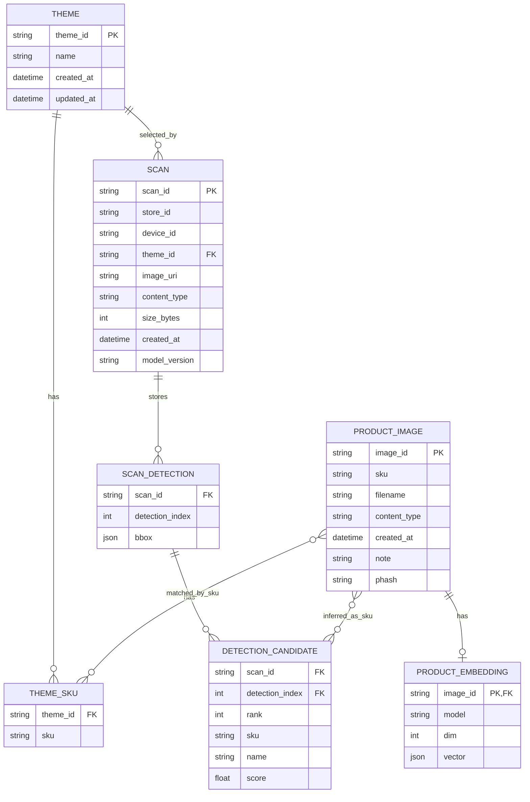

# 03. ER図（論理モデル）

本プロジェクトは一部を JSON ファイルとインメモリで保持します。  
下図は「実装上の論理エンティティ」を ER として整理したものです。

## 図中ラベルの日本語訳

### エンティティ名

| 英語名 | 日本語訳 |
| --- | --- |
| THEME | テーママスタ |
| THEME_SKU | テーマSKU対応 |
| SCAN | スキャン履歴 |
| SCAN_DETECTION | スキャン検出領域 |
| DETECTION_CANDIDATE | 検出候補 |
| PRODUCT_IMAGE | 商品画像マスタ |
| PRODUCT_EMBEDDING | 商品埋め込みベクトル |

### リレーション名

| 英語名 | 日本語訳 |
| --- | --- |
| has | 保持する |
| selected_by | テーマで選択される |
| stores | 保存する |
| matched_by_sku | SKUで対応付ける |
| inferred_as_sku | SKU候補として推論される |

## 実体保存先との対応

- `THEME`: `storage/themes/themes.json`
- `PRODUCT_IMAGE`: `storage/product_images/index.json` + 画像ファイル
- `PRODUCT_EMBEDDING`: `storage/product_images/embeddings.json`
- `SCAN` と推論結果: `scan_store` のインメモリ（画像本体のみ `storage/images`）

## テーブル名・カラム名の日本語訳

## 1. テーブル名（エンティティ名）

| 英語名 | 日本語訳 |
| --- | --- |
| THEME | テーママスタ |
| THEME_SKU | テーマSKU対応 |
| SCAN | スキャン履歴 |
| SCAN_DETECTION | スキャン検出領域 |
| DETECTION_CANDIDATE | 検出候補 |
| PRODUCT_IMAGE | 商品画像マスタ |
| PRODUCT_EMBEDDING | 商品埋め込みベクトル |

## 2. カラム名

| 英語名 | 日本語訳 |
| --- | --- |
| theme_id | テーマID |
| name | 名称 |
| sku | 商品管理コード |
| scan_id | スキャンID |
| store_id | 店舗ID |
| device_id | 端末ID |
| image_uri | 画像保存先URI |
| content_type | コンテントタイプ（MIME種別） |
| size_bytes | サイズ（バイト） |
| created_at | 作成日時 |
| updated_at | 更新日時 |
| model_version | モデルバージョン |
| detection_index | 検出インデックス |
| bbox | バウンディングボックス（検出領域） |
| rank | 候補順位 |
| score | 類似度スコア |
| image_id | 画像ID |
| filename | ファイル名 |
| note | 備考 |
| phash | 知覚ハッシュ |
| model | モデル名 |
| dim | 次元数 |
| vector | ベクトル |
