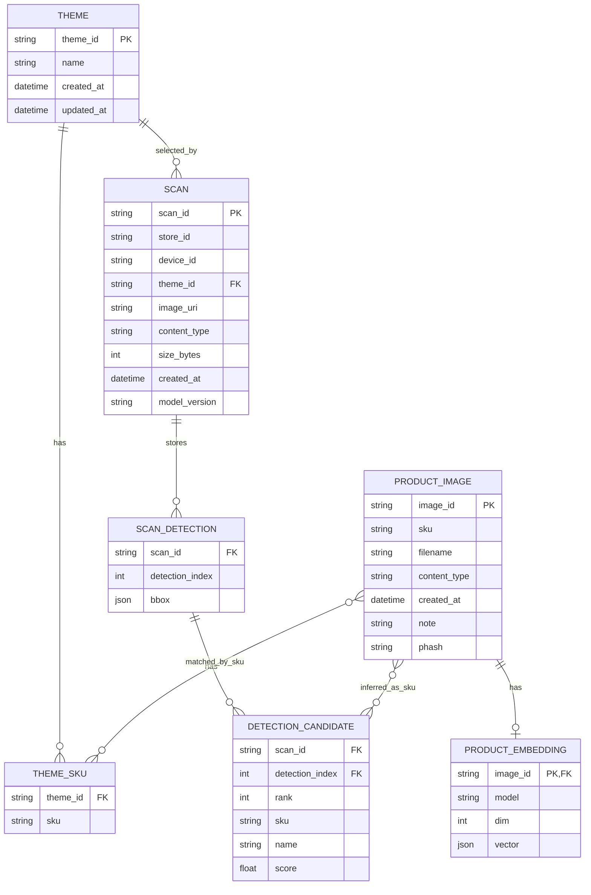

# 03. ER図（論理モデル）

本プロジェクトは一部を JSON ファイルとインメモリで保持します。  
下図は「実装上の論理エンティティ」を ER として整理したものです。

## 実体保存先との対応

- `THEME`: `storage/themes/themes.json`
- `PRODUCT_IMAGE`: `storage/product_images/index.json` + 画像ファイル
- `PRODUCT_EMBEDDING`: `storage/product_images/embeddings.json`
- `SCAN` と推論結果: `scan_store` のインメモリ（画像本体のみ `storage/images`）
