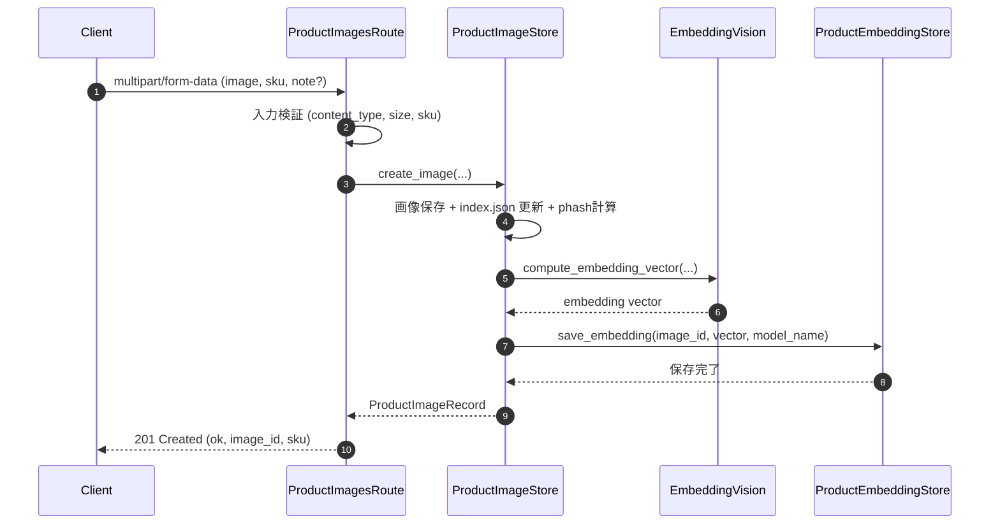
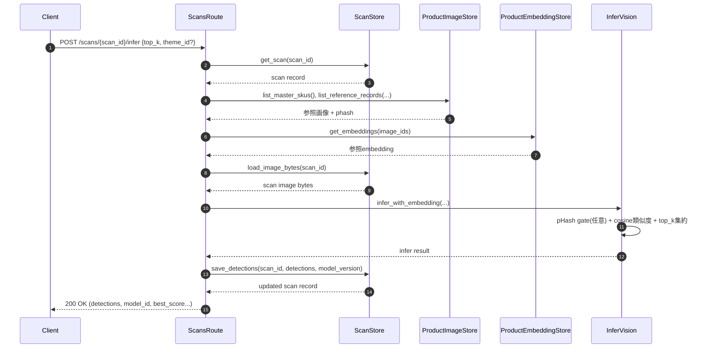
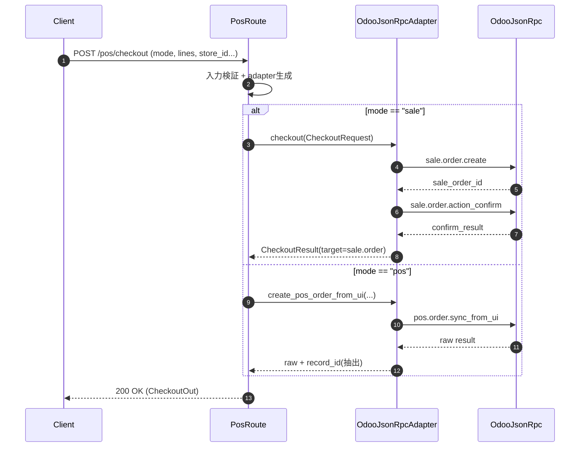

# 05. シーケンス図

このドキュメントは、現行実装（FastAPI + JSON ストア + Odoo Adapter）の主要処理フローを示します。

## 1. 商品画像登録（`POST /product-images`）

## 2. スキャン推論（`POST /scans/{scan_id}/infer`）

## 3. チェックアウト（`POST /pos/checkout`）

## 4. 用語の日本語訳

| 英語 | 日本語訳 |
| --- | --- |
| Client | クライアント |
| Route | ルート（API入口） |
| Store | ストア（永続化管理） |
| Adapter | アダプタ（外部連携窓口） |
| create_image | 画像登録 |
| save_embedding | 埋め込み保存 |
| infer_with_embedding | 埋め込み推論 |
| checkout | 会計登録 |
| scan | スキャン |
| detections | 検出結果 |
